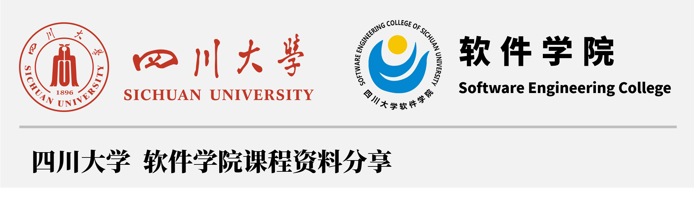

# 🦄 SCU-SE-Space | 四川大学软件学院课程资料分享计划

> Breaking the barrier of information, Engineering the future.

<div align="center">  
     
</div>

      

---

## 🏛️ 项目愿景：重构学习的“生命周期”

软件工程有一条黄金法则：**Don't Repeat Yourself (DRY)**。然而，在本科四年的求学过程中，我们遗憾地发现，每一届 SCU SEer 都在重复着完全相同的“造轮子”过程——**花费大量精力去重新梳理那些碎片化的知识脉络，在基础性的探索路径上反复试错，或是将宝贵的时间无意义地消耗在那些本应标准化的重复劳动中**。这种低效的循环，是对智力资源和时间资源的极大浪费😥。

我们建立这个仓库的初衷，是希望引入**“版本控制”🌿**与**“持续集成”**♻️的工程思想，将过往学长学姐的优质学习成果视为**“核心资产”**进行开源与维护。对于软院学生而言，这里存放的不仅仅是应试的笔记，更是前人经过实战检验的**工程经验**。我们希望后来者能在前人的 `Base` 分支上进行 `Merge` 与 `Refactor，将更多的时间精力投入到更高维度的系统架构思考与技术创新中，而不是被琐碎的重复劳动所羁绊。这不仅是一个资料库，更是我们践行软件工程精神的试验场🔋。

本项目于 **2025 年 12 月 20 日** 正式启动，致力于构建一套属于**四川大学软件学院学子**的知识基础设施 🏗️。我们的开源版图全面覆盖了**软件工程**、**计算机科学与技术<sup>[注]</sup>**的核心专业方向。 

> 注：关于计算机科学与技术（计算机大类）的特别说明。针对 **2024 级及以后** 的同学，学院已实行**计算机大类招生政策**。这意味着在大一上学期，计算机大类的所有专业学习内容是完全相同的。因此，本仓库中大一阶段的资料适用于所有专业，请大家放心参考。

## ⚠️ 核心声明：接入社区的“握手协议”

**1. 关于知识产权与开源协议：**本项目收录的所有资料，**主要源于贡献者的自愿提交与分享**。仓库内的所有资料均默认采用 🔓 **[CC BY-NC-SA 4.0](https://creativecommons.org/licenses/by-nc-sa/4.0/deed.zh)** 进行许可。这意味着，在**非商业用途**的前提下，您可以**自由地复用、修改这些资料**，但请**务必保留原作者的署名** ✍️。若您发现任何潜在的侵权行为，请立即联系我们，我们将执行回滚操作并删除相关内容。

**2. 关于学术诚信与使用规范： **所有资料均带有强烈的**时间戳特征** ⏰，仅代表当时的教学大纲与技术版本。软件工程是一门强调实践与演进的学科，我们**严禁任何形式的无脑搬运或直接抄袭**🐖。请将这些资料视为“**参考实现**”，而非“**标准答案**”。请大家严格遵守学校学术道德规范，结合当年的具体要求进行泛化学习。***切记：抄袭不仅无法通过查重系统，更是对自身工程能力的自我阉割。***

**3. 关于免责说明与反馈机制：**本项目的初衷是打破信息壁垒，构建互助社区。虽然我们会对合入的 PR 进行审核，但资源来源于往届学生，我们**无法对内容的绝对正确性与实时有效性提供担保**。在使用过程中，请保持**批判性思维**🧠。如果您发现了 Bug 🐛 或有更好的解题思路，欢迎联系我们**进行修正**。我们相信，开源社区的自我修复能力是其最强大的特性。

**4. 关于开源精神与共建：**这是一个**完全非营利、永久免费的开源项目**。我们没有任何商业化诉求，唯一的动力源于对技术分享的热爱🔥。如果您有高质量的课程资料，并且**您拥有这些资料的完整版权**，诚挚邀请您加入我们。如果这个仓库曾为您节省了 `O(n)` 的检索时间，或是帮您规避了学习路径上的 `Exception`，希望您能点亮右上角的 **Star 🌟**，这将是我们开源工作的**最大认可**和持续维护的**最大动力**！


## 🌟 核心特色 (Highlights)

本项目谢绝千篇一律的堆砌，我们针对软件学院的培养方案进行了特色的架构设计：

-   **🎯 选修课"技能树"分类 (Track-Based Structure)**
    不同于传统的按学期分类，我们将选修课程按照 **专业方向 (Specialization Tracks)** 进行了重组：
    -   `人工智能与数据分析`：数据挖掘、机器学习...
    -   `移动和Web应用开发`：前端技术、移动应用...
    -   `数字媒体及图像处理`：图形学、游戏设计...
    -   `软件工程通用`：项目管理、测试...
    
    这样的设计旨在让你更清晰地依照自己的 **职业规划 (Career Path)** 查找资料，而非仅仅是为了应付考试。

-   **🛠️ 强调工程实战**
    我们深知 SEER 们的痛点在于大作业和项目。因此，本仓库特别标注并整理了各科目的 **Project** 资源，提供从需求分析 -> 概要设计 -> 编码实现 -> 测试文档的全流程参考。

## 🗂 目录导航 (Architecture)

本仓库的文件组织逻辑如下，清晰明了，方便索引：

```text
SCU-SE-Course-Resources/
├── 📂 必修 (Compulsory)          # 主线任务：打好基础，通关必修
│   ├── 01_大一上_Year1_Sem1      # 启程：高等数学、导论...
│   ├── 02_大一下_Year1_Sem2      # 探索：离散数学、C语言...
│   ├── 03_大二上_Year2_Sem1      # 进阶：数据结构、Java...
│   └── 04_大二下_Year2_Sem2      # 核心：操作系统、数据库...
│
└── 📂 选修 (Elective)            # 支线任务：点亮技能树
    ├── 🤖 人工智能与数据分析方向   # AI Track
    ├── 🎨 数字媒体及图像处理方向   # Media Track
    ├── 📱 移动和Web应用开发方向    # Web/Mobile Track
    └── ⚙️ 软件工程通用方向         # General SE Track
```

> **Tip**: 善用 `Ctrl + F` (Windows) 或 `Cmd + F` (Mac) 在页面搜索你的课程名称。

## 🚀 快速开始 (Usage)

我们推荐使用 Git 进行版本管理，这也是软件工程师的基本素养：

1.  **Clone 本项目**
    ```bash
    git clone https://github.com/YourUsername/SCU-SE-Course-Resources.git
    ```
    *(如果是下载 Zip 包，请记得定期回来 Check Updates)*

2.  **查找资料**
    进入对应目录查看。文件名通常包含了 `年份_类型_说明`，例如 `2023_LabReport_JavaSpaceWar`。

3.  **Star & Watch**
    如果你觉得本项目对你有帮助，请点击右上角的 **Star** 🌟，这不仅是对贡献者的感谢，也能让你第一时间获取更新推送。

## 🤝 如何贡献 (Contribution)

开源精神是软件工程的灵魂。我们非常欢迎你提交 Pull Request (PR) 或 Issue。

为了帮助大家更好地参与贡献，我们整理了详细的指南：

-   📘 **[贡献指南 (Contributing Guide)](./assets/CONTRIBUTING.md)**: 关于 Fork、PR 流程、**文件命名规范** 及 Git 注意事项。

**简要 Checklist**:
1.  **Commit Message**: 请语义化你的提交，例如 `feat: add OS 2024 final exam`.
2.  **脱敏**: 务必**移除**个人隐私信息（姓名、学号）。
3.  **版权**: 确保资料为原创或已获授权。**严禁上传任何老师的课件**，保护知识版权。

## ⚠️ 免责声明 & 协议 (Disclaimer)

1.  **学术诚信 (Academic Integrity)**: 
    -   严禁直接抄袭（Plagiarism）本仓库中的代码或文档用于作业/考试提交。
    -   所有的代码和文档仅供 **学习参考 (Reference Only)**。请理解代码背后的逻辑，写出属于你自己的 Implementation。
    -   因直接抄袭产生的任何后果，本项目及贡献者概不负责。

2.  **License**:
    -   本仓库资料遵循 [CC-BY-NC-SA 4.0](http://creativecommons.org/licenses/by-nc-sa/4.0/) 协议。
    -   你可以自由分享、修改，但必须署名、非商业使用，且以相同协议共享。

---

**Show me the code, and let's change the world.**
Designed with ❤️ by SCU SE Students.
